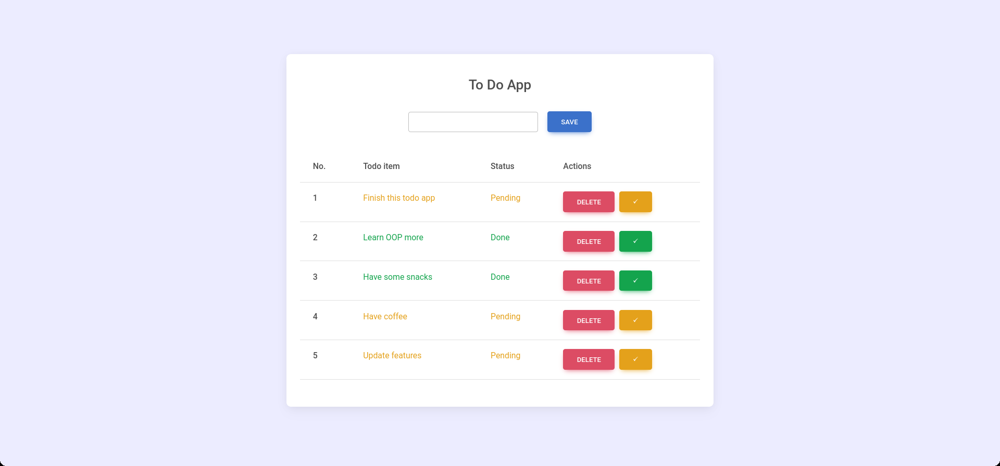

# Todo List

## Table of Contents

- [Todo List](#todo-list)
  - [Table of Contents](#table-of-contents)
  - [Introduction](#introduction)
  - [Features](#features)
  - [Installation](#installation)
  - [Screenshots](#screenshots)
  - [Usage](#usage)
  - [Contributing](#contributing)
  - [License](#license)

## Introduction

This is a simple todo list application that allows you to add, and delete tasks. It is built using Core JavaScript. To store the tasks, the application uses the browser's local storage. So the tasks will persist even after the browser is closed. Done tasks are shown in Green and undone tasks are shown in brownish yellow.

## Technologies Used

- HTML
- CSS
- JavaScript
- OOP
- Local Storage
- GitHub
- Boostrap

## Features

- Add tasks
- Mark tasks as complete
- Delete tasks

## Installation

1. Clone the repository
2. Open `index.html` in your browser

## Screenshots

## Usage

1. Add a task by typing in the input field and pressing enter
2. Edit a task by clicking on the task text
3. Delete a task by clicking on the delete button
4. Mark a task as complete by clicking on the tick button

## Contributing

Pull requests are welcome. For major changes, please open an issue first to discuss what you would like to change.

## License

[MIT](https://choosealicense.com/licenses/mit/)
